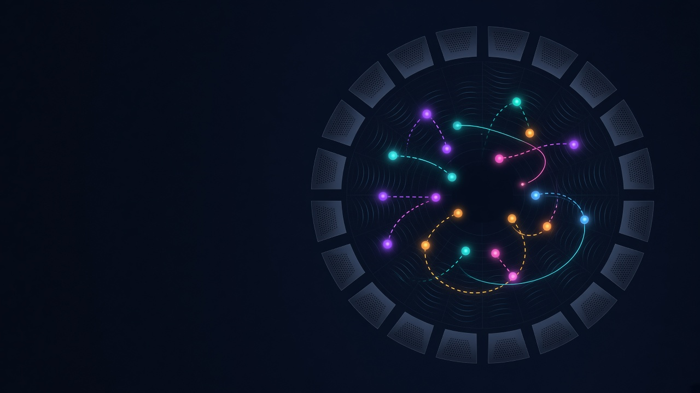

# OBJITTER


**Made by DREAMSCAPE** — Objitter 는 DREAMSCAPE 가 만들고 관리하는 소프트웨어입니다.<br />
© 2026 DREAMSCAPE Inc. All rights reserved. 사내 전용 · 무단 복제·배포 금지.



이머시브 오디오 시스템(SPAT Revolution, L-ISA, d&b Soundscape DS100, ADM-OSC 렌더러)의 오브젝트를 **랜덤 / 탭 템포 동기**로 움직이는 서드파티 오브젝트 모션 컨트롤러입니다.
Node.js 로컬 서버가 모션 엔진·타임코드 큐 엔진·OSC(UDP) 송신을 맡고, 조작은 웹 브라우저에서 합니다. macOS / Windows 모두 동작하며 같은 네트워크의 태블릿·다른 PC 브라우저에서도 접속할 수 있습니다.

```
[브라우저 UI] ⇄ WebSocket ⇄ [Node 서버: 모션 엔진 + 큐 엔진 + 프리셋] ── OSC/UDP ──▶ 출력 대상 1…8
      ▲ MTC(Web MIDI) / LTC(오디오)          ▲                              (SPAT / L-ISA / DS100 / ADM / Custom)
                                  OSC 컨트롤·타임코드 입력 (QLab, 콘솔, Companion 등, 기본 UDP 9000)
```

## 실행

1. [Node.js](https://nodejs.org) 18 이상 설치 (LTS 권장)
2. 실행
   - **Windows**: `start-windows.bat` 더블클릭. 서버가 뜨면 브라우저가 자동으로 열립니다.
   - **macOS**: `start-mac.command` 더블클릭 — 자세한 내용은 아래 [macOS (Apple Silicon) 실행 가이드](#macos-apple-silicon-실행-가이드)
   - 터미널: `npm install` 후 `npm start`
3. 브라우저에서 `http://localhost:8080` 접속 (처음에는 "Connecting to server…" 화면이 잠깐 보인 뒤 UI 가 나타납니다)

### 언어 (English / 한국어)

- UI 기본 언어는 **영어**입니다. 상단 바 로고 오른쪽의 `EN | KO` 토글로 바꾸면 새로고침 없이 바로 바뀝니다.
- 선택은 **브라우저마다** `localStorage` 에 저장됩니다 (서버 PC 는 영어, 태블릿은 한국어처럼 따로 쓸 수 있음). `<html lang>` 도 같이 바뀌어 스크린리더·맞춤법 검사가 올바른 언어를 씁니다.
- 서버가 보내는 알림·확인·오류도 키 + 값으로 전달되어 각 브라우저의 언어로 표시됩니다. 서버 콘솔 로그와 OSC 응답은 영어입니다.
- 용어는 업계 표기를 따릅니다: Crossfade(XF), Pre-roll, Chase, Freewheel, Standby, GO, Quick Slot, Show lock 등.
- 번역 파일: `public/lang/en.js`, `public/lang/ko.js` (같은 키·같은 `{자리표시자}` 를 가져야 하며 `npm test` 가 검사합니다). 새 문구는 두 파일에 같은 키로 추가하고 코드에서는 `t('키', { 값 })` 으로 씁니다. 출력 시스템의 옵션 이름·도움말은 `server/adapters.js` 에 `{ en, ko }` 쌍으로 있습니다.

### 다른 포트로 실행

포트 8080 이 이미 사용 중이면 서버가 안내 메시지를 출력하고 종료합니다 (Objitter 가 이미 실행 중일 수 있습니다).

| 환경 | 명령 |
| --- | --- |
| PowerShell | `$env:PORT=8081; npm start` |
| cmd | `set PORT=8081 && npm start` |
| macOS / Linux | `PORT=8081 npm start` |

`start-windows.bat` / `start-mac.command` 도 `PORT` 환경 변수를 따릅니다. 숫자가 아니거나 1–65535 범위를 벗어난 `PORT` 는 경고를 출력하고 8080 을 씁니다 (서버도 같은 경고를 출력).

### 환경 변수

| 변수 | 기본값 | 설명 |
| --- | --- | --- |
| `PORT` | `8080` | 웹 UI / WebSocket 포트 |
| `HOST` | 모든 인터페이스 | 바인드 주소. `127.0.0.1` 로 두면 이 컴퓨터에서만 접속 가능 |
| `CONTROL_PORT` | 저장된 값 (기본 `9000`) | OSC 컨트롤 입력 UDP 포트. UI 설정보다 우선하며 **저장되지 않습니다** (환경 변수를 빼고 실행하면 UI 에서 저장한 포트로 돌아감) |
| `ALLOWED_HOSTS` | 없음 | 추가로 허용할 호스트 이름(쉼표 구분). 아래 '보안' 참고 |
| `DATA_DIR` | `./data` | 마지막 상태(`state.json`)와 세션(`sessions/`) 저장 위치 |
| `PRESET_DIR` | `./presets` | 프리셋 폴더 |
| `LIBRARY_DIR` | `./library` | 오브젝트 라이브러리 폴더 (하위 폴더 = 라이브러리 폴더) |

## 보안 / 네트워크 주의

- 서버는 기본적으로 모든 네트워크 인터페이스에서 접속을 받습니다. **인증이 없으므로** 같은 네트워크의 누구나 UI 를 열고 조작할 수 있습니다. 공연/쇼 네트워크처럼 닫힌 LAN 에서만 사용하세요. 공인 IP 가 붙은 PC 이거나 공용 Wi-Fi 라면 `HOST=127.0.0.1` 로 실행하거나 방화벽에서 8080/TCP·9000/UDP 를 막으세요.
- **Host 헤더 검사 (DNS 리바인딩 방지)**: `localhost`, `127.0.0.1`, `[::1]`, 이 PC 의 이름(`이름`, `이름.local`), 네트워크 인터페이스 IP, `*.localhost`, `HOST`, `ALLOWED_HOSTS` 로 접속한 요청만 받습니다. 그 밖의 이름(예: 사내 DNS 별칭)으로 접속하면 `403` — `ALLOWED_HOSTS=show-pc.lan` 처럼 추가하세요.
- 다른 사이트에서 WebSocket 으로 접속하는 것은 Origin + Host 검사로 차단됩니다.
- 파일 경로에 `:` 가 들어간 요청(NTFS 대체 데이터 스트림, 드라이브 경로)은 거부합니다.
- WebSocket 메시지는 일반 256 KB, 쇼/프리셋 가져오기 2 MB 까지입니다. 데이터를 읽지 못하고 4 MB 이상 밀린 클라이언트는 서버 메모리를 지키기 위해 끊습니다 (브라우저는 자동 재연결).
- OSC 컨트롤 포트도 인증이 없습니다. 필요 없으면 출력 설정에서 끄거나 `허용 IP` 에 콘솔/QLab PC 의 IP 만 적으세요 (비우면 모두 허용).

## 주요 기능

| 기능 | 설명 |
| --- | --- |
| 32 오브젝트 | 오브젝트마다 소스 번호, 모드, 영역, 타이밍을 독립 설정. 다중 선택 후 일괄/상대 편집 |
| 그룹 | 선택한 오브젝트를 이름 붙인 그룹으로 저장(최대 16, 색 지정). 칩 클릭 = 선택, Shift+클릭 = 추가. 큐 대상·OSC 주소에서 `@이름` 으로 사용 |
| 모션 모드 | **고정 / 지터(점프) / 글라이드(이동) / 패스(경유점) / 드리프트(노이즈) / 오빗(궤도)** |
| 궤적 직접 그리기 | 패스 모드에서 `경유점 → 직접 그리기`. 무대에 포인트를 찍거나 자유 곡선으로 그린 궤적을 따라 움직입니다. 아래 참고 |
| 점프 + 이동 혼합 | 글라이드·패스의 `점프 확률`로 지터를 섞고, `이동 비율 (레가토)`로 "빠르게 이동 후 정지" 표현. `점프 이동 시간`(0~2000 ms): 0 = 순간이동, ≤50 ms = 클릭 방지, 100 ms 이상 = 눈에 보이는 빠른 슬라이드 |
| 점프 표시 | 스테이지에서 점프는 잔상을 끊고 점선 + 착지 링으로 표시 (서버가 점프 이벤트를 알려 줌) |
| 최대 속도 제한 | 출력 설정의 `최대 속도`(단위: 정규화 좌표/초). 켜져 있으면 상단에 주황 `VMAX` 배지. `의도된 점프는 제외`(기본 켬)면 점프·점프 이동 시간은 제한하지 않고 나머지 움직임만 제한 |
| 영역 모양 | 사각 / 타원 / 링(안쪽 비율). 영역 안에서 균일하게 랜덤 위치 선택 |
| 속도 | `자유(초)`: 최소~최대 초 사이 랜덤. `템포 동기`: 선택한 박 분할(기본·셋잇단·점음표) 중 랜덤, `박에 맞춤 / 이어 붙이기`, 위상 오프셋, 쉼 확률 |
| 전체 속도 | SPEED 0~4× (램프 적용, 0 = 정지), 템포 배율 ¼·½·1·2·4 |
| 탭 템포 | TAP / `T` / OSC. 중앙값 기반, 이상치 제거, 탭 위상에 정렬. `RESYNC`(R)는 진행 중 이동을 끊지 않고 다음 박으로 재정렬 |
| 전환 | 프리셋·슬롯·큐 호출은 **즉시 새 영역으로 생성기를 옮기고** XF 시간 동안 크로스페이드합니다 — 모든 모드에서 페이드 + 1 프레임 안에 새 영역에 도착 (예전처럼 다음 스텝까지 옛 영역에 머무르지 않음). FREEZE, RETURN |
| 정지 동작 | 정지 시 `현재 위치 유지 / 중심 복귀(페이드) / 송신 중단` 선택. 비활성화 시 `송신 중단 / 중심 복귀` |
| LIVE EDIT | 상단 `LIVE EDIT` (기본 켜짐, `L`). 아래 참고 |
| 오브젝트별 재생/멈춤 | 오브젝트 타일에 마우스를 올리면 ▶ / ⏸ 버튼이 나타납니다 (터치에서는 타일 오른쪽 아래에 항상 표시). 전체 재생 중 ⏸ = 그 오브젝트만 현재 위치에서 멈춤 (타일에 작은 ⏸ 표시), 전체 정지 중 ▶ = 그 오브젝트만 재생 (START 버튼에 "N playing" 표시). `P` = 선택한 오브젝트 재생/멈춤. 글로벌 START / STOP 은 그대로이며, 누르면 개별 상태를 모두 초기화합니다 (START = 전부 재생, STOP = 전부 정지). 잠금 중에도 사용 가능 (트랜스포트). 개별 상태는 프리셋·세션에 저장되지 않습니다 |
| 프리셋 | 장면 전체 저장 / 전체·선택 오브젝트에 불러오기 / 페이드 / 덮어쓰기 확인(원래 오브젝트 범위 유지, `BPM·속도 함께 저장` 선택) / 색(8색)·메모 / "사용 중: 큐 3·7" 표시 / JSON 내보내기·가져오기 |
| BPM·속도 | 프리셋을 불러와도 기본적으로 **현재 BPM·속도·템포 배율을 유지**합니다. `BPM·속도·템포 배율도 불러오기` 를 켜거나 큐에서 `globals = preset` 을 고르면 프리셋 값으로 (속도는 페이드 시간 동안 램프) |
| 퀵 슬롯 | 32 슬롯(2줄 × 16, 태블릿 4줄 × 8). 키보드·클릭·OSC·큐로 호출. 프리셋 색, 단축키 표시, 마지막 호출 슬롯·다음 큐 슬롯 강조. 슬롯 메뉴의 `현재 장면을 슬롯 N에 저장` = 32 오브젝트 전체 스냅샷 |
| 타임코드 큐 | MTC / LTC / OSC / **내부 클럭** 에 맞춰 프리셋·START·STOP·RETURN·FREEZE·**클립** 실행, 또는 **GO 리스트**(수동 진행) |
| 작업 창 | **Setup**(출력 · 타임코드 · 무대 설정 · OSC 로그 · 시스템) · 쇼 · 오토메이션 · 모니터. 기본은 별도 창, `Shift`+클릭 = 메인 화면 위에. 아래 참고 |
| 오브젝트 세부설정 창 | 왼쪽 오브젝트 목록에서 **우클릭** → 그 오브젝트 하나의 모션 편집 + 라이브러리 창. 다른 오브젝트를 우클릭하면 같은 창의 대상이 바뀜 |
| 오브젝트 라이브러리 | 오브젝트 하나의 모션(모드·속도·궤적 등)을 이름 붙여 서버 폴더에 저장하고, 다른 오브젝트·큐·클립에서 불러오기. 아래 참고 |
| 모니터 창 | 무대와 높이 띠만 보여 주는 보기 전용 창 (조작·단축키 없음) |
| 쇼 타임라인 | 큐 리스트 + 타임라인. 큐 하나에 오브젝트별 시간 클립(움직임·이동·경로·프리셋·라이브러리·RETURN·재생/정지)을 넣어 끌어서 편집 |
| 오토메이션 | 파라미터 곡선(중심·범위·속도·글라이드·위치 등)을 쇼 시간이나 큐 시간에 맞춰 재생하고, Touch / Latch / Write 로 녹화 |
| 무대 설정 | 무대 캔버스에 배경 이미지(PNG/JPEG/WebP)와 스피커 레이아웃(SPAT JSON, L-ISA, CSV — 64 MB 까지)을 그림. 스피커를 직접 추가·배치할 수도 있음 |
| OSC 로그 | Setup → OSC 로그: 들어오고 나가는 OSC 를 실시간으로 보기 (방향 필터·검색·일시정지) |
| 다중 출력 | 최대 8개 출력 대상(시스템·IP·포트·빈도·소스 번호 오프셋·좌표 변환 각각). 백업 렌더러용 `미러(백업)` 추가 |
| 변주 도구 | 배치(Scatter: 원·가로줄·세로줄·격자·랜덤), Humanize, 시드(같은 움직임 재현 — 프리셋/큐 호출마다 같은 시드로 다시 시작, 큐의 `시드 오프셋` 으로 변주) |
| 되돌리기 | `Ctrl+Z` (서버 측, 20 단계). 큐·GO·OSC 슬롯 호출은 되돌리기 기록을 남기지 않습니다 (공연 중 큐가 되돌리기 목록을 덮지 않도록) |
| 쇼 잠금 | `잠금` 버튼 — **서버에 저장되어 모든 접속 기기에 동시에 적용**됩니다 (아래 참고) |
| 세션 | 공연 전체를 한 파일로 저장·불러오기 (`Ctrl/⌘+S`, `Ctrl/⌘+O`). 아래 참고 |

### 작업 창 (Workspaces)

넓은 화면이 필요한 편집은 메인 화면에서 빠져 **작업 창**으로 열립니다. 오른쪽 패널 탭 줄의 작업 창 버튼(Setup · 쇼 · 오토메이션 · 모니터)으로 엽니다.

- **기본은 별도 창**입니다 (`?ws=show` 처럼 같은 페이지를 새 창으로, 접속과 상태 공유). 두 번째 모니터에 타임라인을, 메인 모니터에 무대를 두고 쓸 수 있습니다. `Shift`+클릭 = 메인 화면 위에 전체 화면으로. 브라우저가 팝업을 막으면 메인 화면 위에 열고 안내합니다. Setup → 시스템 → `작업 창을 별도 창으로 열기` 로 기본값을 바꿀 수 있습니다 (이 브라우저에만 저장).
- 메인 화면 위에 연 작업 창은 상단 바 아래를 덮고, 상단 바(START/STOP, TC/GO, 잠금)는 그대로 보입니다. 머리줄의 탭으로 전환하고 `⧉` 로 분리합니다.
- **Setup** 은 시스템 설정을 한곳에 모은 창입니다. 안의 탭: `출력`(출력 대상) · `타임코드`(TC 입력·큐 리스트) · `무대 설정` · `OSC 로그` · `시스템`(OSC 컨트롤 입력, 원격 접속 주소, 창 열기 방식). `?ws=setup&tab=stage` 처럼 탭을 지정해 열 수 있고, 예전 주소 `?ws=output` · `?ws=tc` · `?ws=stage` 도 해당 탭으로 열립니다.
- **OSC 로그** (Setup → OSC 로그): 서버가 받은(IN) / 보낸(OUT) OSC 를 시각·상대 주소·OSC 주소·인자로 보여 줍니다. 허용 IP 밖에서 온 메시지는 `거부` 로 표시. 같은 주소의 빠른 흐름(25 Hz 위치 등)은 주소마다 초당 5줄로 줄이고 생략한 개수를 `+n` 으로 표시합니다. 방향 필터·주소 검색·일시정지·지우기. 이 탭을 보고 있는 동안만 서버가 수집합니다 (최근 500줄).
- **모니터** (`?ws=monitor`): 무대와 높이 띠만 크게 보여 주는 보기 전용 창. 선택·드래그·단축키가 모두 꺼져 있어 객석·FOH 의 보조 화면에 띄워 두기 좋습니다.
- **오브젝트 세부설정 창**: 왼쪽 오브젝트 목록에서 오브젝트를 **우클릭** → 그 오브젝트만 다루는 창(`?obj=5`)이 열립니다. 무대 + 모션 편집기 + 라이브러리. 창이 열린 채로 다른 오브젝트를 우클릭하면 같은 창의 대상이 바뀝니다. 오른쪽 패널의 모션 편집(여러 오브젝트 동시 편집)은 그대로입니다.
- 키: `Esc` = 열린 메뉴 → 작업 창 닫기 → 정지 순서 (공통 규칙). `Shift+Esc` = 언제나 정지, `Space` = 시작. 분리된 창에서도 같습니다 (모니터 창 제외).

### 오브젝트 라이브러리

오브젝트 **하나의 모션**(모드·속도·타이밍·궤적 `pathPts`·드리프트/오빗 설정 등)을 이름 붙여 저장해 두고 다른 오브젝트에 다시 쓰는 기능입니다. 프리셋·퀵 슬롯이 "장면 전체" 라면 라이브러리는 "움직임 하나" 입니다.

- 오른쪽 패널(또는 세부설정 창)의 `라이브러리` 탭 → 오브젝트 하나를 선택하고 `모션 저장` → 작은 창에서 이름, 폴더(또는 새 폴더), `영역 포함`, 메모.
  - `영역 포함` 을 끄면(기본) 중심·범위·모양을 빼고 저장하므로, 적용해도 각 오브젝트는 제자리에서 그 움직임만 받습니다. 켜면 위치까지 옮깁니다.
- 항목 클릭 = 선택한 오브젝트에 적용 (XF 페이드, 되돌리기 1 단계). `⋯` = 이름 바꾸기 / 폴더 이동, `✕` = 삭제(두 번 눌러 확인, 큐에서 쓰면 다시 확인). 폴더는 4 단계까지, 항목은 최대 2000개. 검색 상자로 이름·메모를 찾습니다.
- 큐 동작 `라이브러리 적용` (대상·페이드·곡선·스태거) 과 쇼 타임라인의 클립 종류 `라이브러리` 에서도 불러올 수 있습니다. 항목이 없어지면 큐 행에 `누락` 이 표시되고 실행 시 경고합니다.
- 저장 위치: `library/<폴더>/<이름>.json` (`LIBRARY_DIR`). 경로 문자·`..` 는 거부하고, 한글 조합형(NFC/NFD) 차이는 같은 이름으로 취급합니다. 쇼 잠금 중에는 저장·삭제·이동이 막히고 적용은 됩니다.

### 무대 설정 (배경 이미지 · 스피커 레이아웃)

`Setup → 무대 설정` 탭: 왼쪽 미리보기, 오른쪽 조절 항목.

- **배경 이미지**: PNG / JPEG / WebP, 10 MB 이하. 크기·위치·회전·불투명도. 미리보기에서 끌어 옮기고 휠로 확대합니다. 파일은 내용 해시 이름으로 `DATA_DIR/assets/` 에 저장되고, 같은 주소(같은 출처)의 브라우저만 올릴 수 있습니다.
- **스피커 레이아웃 가져오기**: 형식은 파일 내용으로 자동 판별합니다. 파일은 HTTP(`POST /api/layout`, 같은 출처만, 64 MB 까지)로 서버에 올려 해석하므로 큰 SPAT 세션·L-ISA 파일도 받습니다. 해석 결과는 10 분 동안 보관되고 룸을 고르면 적용됩니다.
  - SPAT Revolution JSON: 룸이 여러 개면 목록에서 고릅니다 (스피커가 가장 많은 룸이 미리 선택됨). 방위·고도·거리를 XYZ 로 변환합니다.
  - L-ISA (`.lisa`, XML): `Speakers` 버스의 채널 좌표(m)와 `Sub` 그룹(서브).
  - CSV / TSV: `name,x,y,z`(m) 또는 `name,az,el,dist`. QLab 에서 내보낸 표도 이 형식으로 받습니다. (QLab 오디오 맵 전용 파서는 샘플 파일을 받은 뒤 추가 예정)
- **변환**: m/단위(1.0 이 몇 m 인지), 이동, 회전, 좌우 반전, 이름 표시, `레이아웃에 맞추기`(가장 먼 스피커가 1.0 에 오도록). 스피커는 방향이 있는 박스로, 서브는 다른 모양으로 그립니다.
- **스피커 직접 배치**: `스피커 추가` / `서브 추가` 로 하나씩 만들고, 목록에서 행을 누르면 이름·종류·X/Y/Z(m, 청취 위치 기준: X 오른쪽, Y 앞, Z 위)·방향(비우면 중앙을 향함)을 입력하는 칸과 `삭제` 가 열립니다. 위쪽 `끌어서 이동: 스피커` 상태에서 미리보기의 스피커를 끌면 그 스피커만 옮겨지고, 빈 곳을 끌면 레이아웃 전체가 이동합니다. 가져온 레이아웃에 더하거나 고칠 때도 같습니다. 최대 256개.
- 메인 무대의 범례에 `이미지` / `스피커` 표시 토글이 생깁니다 (이 브라우저의 보기 설정).
- 배경과 레이아웃은 상태·세션에 저장됩니다. 쇼 잠금 중에는 바꿀 수 없습니다.

### 쇼 타임라인 (클립 큐)

`쇼` 작업 창: 왼쪽 큐 리스트(타임코드 탭과 같은 표), 오른쪽 타임라인과 속성 패널.

- 타임라인은 위에 큐 블록 줄, 아래에 오브젝트마다 한 줄(레인)입니다. TC 모드는 큐의 TC 위치에, GO 모드는 순서대로 이어서 그립니다. `켜진 오브젝트만` 을 켜면 꺼져 있고 클립도 없는 줄을 숨깁니다.
- 큐 동작 `클립 (타임라인)` 큐는 **오브젝트별 시간 클립**을 담습니다. 클립 종류:
  - `움직임`: 모드·중심·범위·속도 같은 오브젝트 설정 일부 (`오브젝트에서 가져오기` 로 현재 설정 복사)
  - `위치로 이동`: 지정한 점으로 페이드 동안 이동 후 머묾
  - `경로`: 그린 경로(오브젝트의 Drawn path 를 복사) 또는 무작위 경로
  - `프리셋` · `라이브러리` · `RETURN` · `재생 / 정지`
- 클립 필드: 대상(`1-4`, `@그룹`, 비우면 전체), 시작·길이(초, 큐 기준), 페이드·곡선, `끝나면`: `계속`(설정 유지) / `멈춤`(그 자리에서 정지, 다음 움직임 클립이 다시 재생) / `홈으로` / `되돌리기`(클립 시작 직전 설정으로).
- 편집: 레인 더블클릭 = 새 클립(선택한 오브젝트, 없으면 그 줄) — 그 시간에 클립 큐가 없으면 큐를 새로 만듭니다. 클립을 끌면 이동(다른 줄로도), 양 끝을 끌면 길이, `Ctrl`+끌기 / `Ctrl+D` = 복제, `Delete` = 삭제, `←/→` = 미세 이동. 큐 블록을 끌면 큐의 TC 가 바뀝니다. 맞춤: 1 프레임 / 0.1 초 / 1 초 / 끔.
- 화면: `Ctrl`+휠 확대, `Shift`+휠 시간 이동, `Alt`+끌기 화면 이동, 눈금자 클릭 = 위치 이동(내부 클럭일 때). `재생 위치 따라가기`.
- **실행 규칙**: 같은 오브젝트에 클립이 겹치면 **나중에 시작한 클립이 이깁니다**. TC 로 실행된 클립 큐는 TC 위치를 따라가므로, 큐 중간으로 로케이트·체이스하면 그 위치에서 유효한 상태를 짧은 페이드(체이스 페이드)로 한 번에 맞추고, 바뀐 것만 다시 적용합니다. 큐 앞으로 되돌아가면 실행을 취소합니다. 파킹·셔틀 중에는 클립 경계를 실행하지 않습니다 (기존 TC 규칙). GO·▶ 로 실행하면 벽시계 기준으로 진행합니다.
- 다른 큐(프리셋·홈)나 직접 프리셋 호출이 오브젝트를 가져가면 그 오브젝트의 클립은 거기서 놓아 줍니다. **STOP 은 진행 중인 클립 실행을 모두 취소**합니다.
- 클립 큐의 대상 = 클립 대상의 합집합이고, 체이스에서는 장면(프리셋/RETURN) 그룹으로 계산합니다. 클립은 큐당 최대 128개, 시간은 0~3600 초.

### 오토메이션

`오토메이션` 작업 창: 레인마다 파라미터 곡선 하나. 쇼 타임라인과 같은 시간축·재생 위치를 씁니다.

- **레인** = 대상(오브젝트 1~32 또는 마스터) + 파라미터 + 기준 시간.
  - 파라미터: `위치 (x, y, z)` (출력 위치를 직접 지정, 최대 속도 제한은 그대로), 중심 X/Y/Z, 범위 X/Y/Z, 링 안쪽 반지름, 속도 ×, 글라이드, 점프 확률, 경로 흔들림, 드리프트 속도·깊이, 마스터 속도.
  - 기준 시간: `쇼 시간 (TC)` = 타임코드/내부 클럭 위치, 또는 `큐 n` = 그 큐가 실행된 순간부터의 시간 (큐의 TC 위치에 그려짐). 같은 파라미터에 쇼 레인과 재생 중인 큐 레인이 있으면 큐 레인이 이깁니다.
- **오토메이션 값은 오브젝트 설정을 바꾸지 않습니다** (덮어쓰기 계층). 되돌리기·프리셋·세션 장면에 들어가지 않고, 레인을 끄거나 지우면 0.3 초 동안 원래 설정으로 미끄러져 돌아갑니다.
- 모드 (레인 머리의 배지 클릭으로 순환, 또는 속성 패널):
  - `끔`: 무시. `읽기`: 곡선 재생.
  - `터치`: 재생하다가 그 파라미터를 바꾸는 동안만 녹화, 손을 떼고 0.5 초 뒤 다시 재생.
  - `래치`: 터치처럼 시작하고, 손을 뗀 뒤에도 클럭이 멈출 때까지 마지막 값을 기록.
  - `쓰기`: 클럭이 도는 동안 현재 값을 계속 기록.
- **녹화 조건**: 상단 `전체` 가 `쓰기` + 레인 준비(`R`) + 모드가 터치/래치/쓰기 + 쇼 잠금 꺼짐 + 시간이 흐름(쇼 레인은 TC/내부 클럭 재생 중, 큐 레인은 큐 실행 중). 녹화 소스는 무대 드래그·슬라이더·OSC `/objitter/obj/.../set`·`center`, 마스터 속도. 서버가 30 Hz 로 기록하고 점을 줄여(RDP, 범위의 0.2 %) 녹화한 구간만 바꿉니다. 녹화가 끝나면 토스트로 알립니다.
- `전체`: `끔` = 모든 오버라이드 해제, `읽기` = 재생만, `쓰기` = 녹화 허용. 서버를 다시 시작하면 `읽기` 로 시작하고 준비(`R`)도 모두 풀립니다.
- **STOP 중에는 오토메이션 값이 그대로 멈춰 있습니다** (곡선을 따라 움직이지 않음, STOP 은 STOP). 진행 중인 녹화는 STOP 순간 저장됩니다. 쇼 잠금 중에는 재생만 되고 레인 편집·준비·녹화는 막힙니다.
- 곡선 편집: 레인 더블클릭 = 점 추가, 점 더블클릭 = 삭제, 점 끌기 = 이동 (`Alt` = 값 고정, `Ctrl` = 시간 고정, `Shift`+클릭 = 여러 점 선택), 빈 곳 끌기 = 시간 구간 선택 → `Delete` 또는 `구간 지우기`(구간 밖 값은 유지). 점마다 다음 점까지의 곡선: 직선 / 계단 / 부드럽게. `재생 위치에 점` = 현재 값으로 점 추가.
- 레인은 최대 64개, 레인당 점 4000개. 상태·세션·쇼 파일에 저장됩니다.

### 세션 (Session)

세션은 **공연 전체 스냅샷**입니다: 장면(32 오브젝트 설정), 마스터 설정(BPM·속도·템포 배율·XF·정지 동작·최대 속도 등), 출력 대상, OSC 컨트롤 설정, 그룹, 퀵 슬롯 지정(지정된 프리셋 내용도 함께 포함), 타임코드 설정과 큐 리스트(클립 포함), 무대 설정(배경 이미지 파일 포함), 오토메이션 레인. 프리셋이 "장면 하나"라면 세션은 "쇼 하나"입니다.

- 저장 위치: `DATA_DIR/sessions/<이름>.objitter-session.json` (기본 `data/sessions/`). 파일 하나 최대 2 MB — 넘으면 포함 프리셋을 빼고 저장한 뒤 경고합니다.
- 상단 바의 `Session: 이름 •` 배지: `•` 은 저장 후 바뀐 내용이 있다는 뜻입니다 (다른 브라우저에서 바꾼 것도 표시). 클릭하면 세션 창이 열립니다.
- **단축키**: `Ctrl+S` / `⌘S` 저장 (아직 세션이 없으면 이름 입력 창 → `Enter` 로 저장), `Ctrl+Shift+S` / `⇧⌘S` 다른 이름으로 저장, `Ctrl+O` / `⌘O` 세션 창 열기. 브라우저 기본 동작(페이지 저장·파일 열기)은 막습니다.
- 세션 창: 목록(이름·수정 시각·크기) / `Load` / `Save`(덮어쓰기) / `Rename` / `⇩`(내보내기) / `✕`(삭제, 두 번 눌러 확인) / `Save as…` / `Import…`(JSON, 2 MB 이하) / `Export current`(현재 상태를 저장하지 않고 파일로).
- **불러오기는 공연 안전 위주**입니다:
  - 확인 창이 뜨고, `현재 출력 설정 유지 (Keep current output settings)` 가 **기본으로 켜져** 있습니다 — 공연장 장비의 렌더러 IP·포트가 리허설 PC 의 값으로 바뀌지 않습니다. 끄면 출력 대상·OSC 컨트롤도 세션 값으로 바꿉니다.
  - 장면은 XF 시간으로 크로스페이드되고, **재생(START)은 자동으로 시작하지 않습니다** (실행 중이면 계속 실행).
  - 불러오기 직전 상태가 되돌리기(`Ctrl/⌘+Z`)에 남습니다.
  - 세션에 들어 있는 프리셋이 이 PC 에 없으면 복원하고, 같은 이름의 프리셋이 이미 있으면 그대로 둡니다.
  - 타임코드 `제어 켜짐/꺼짐` 은 바꾸지 않습니다. 세션의 TC 입력 종류가 지금과 다르면(예: MTC → LTC) 현재 TC 소스 브라우저는 해제되고 알림이 뜹니다.
  - **쇼 잠금 중에는 불러오기·가져오기·이름 바꾸기·삭제가 막힙니다** (저장·내보내기는 가능).
- 이름은 대소문자·한글 조합형(NFC/NFD, macOS 파일 이름) 차이를 같은 이름으로 취급합니다. 경로 문자(`/ \ :` 등)는 `_` 로 바뀝니다.
- OSC: `/objitter/session/load "이름" [출력포함 0|1]` (기본 0 = 출력 설정 유지, 잠금 중 거부), `/objitter/session/save ["이름"]` (이름을 빼면 현재 세션에 덮어쓰기).
- 다른 버전에서 만든 세션: 형식 버전이 더 높은 파일은 거부하고, 낮은 버전은 자동 변환합니다. 깨진 파일·잘못된 큐는 아무것도 바꾸지 않고 오류를 표시합니다.

### 궤적 직접 그리기 (Drawn path)

1. 오브젝트를 선택하고 모드를 `Path` 로, `Waypoints` 를 `Drawn` 으로 바꿉니다. 처음에는 영역 안에 사각형 4점이 만들어지고 바로 편집 상태가 됩니다 (무대 오른쪽 위에 노란 안내 표시).
2. **Points (포인트)**: 빈 곳 클릭 = 선택한 포인트 다음에 추가 (연속 클릭으로 순서대로 그리기), 선 위 클릭 = 그 사이에 끼워 넣기, 드래그 = 이동, 우클릭 / `Alt`+클릭 / `Delete` = 삭제. 높이는 아래 정면 뷰에서 포인트를 위아래로 드래그하거나 편집기의 `Point height` 로.
3. **Freehand (자유 곡선)**: 무대에 선을 그리면 최대 24점으로 줄여 부드러운 경로가 됩니다 (기존 포인트 대체). 그리면 자동으로 `Curved` + `Even speed` + 선형 이징 + 이동 비율 100% 가 됩니다. 시작점 근처에서 끝내면 닫힌 모양으로 처리합니다.
4. `Esc` = 편집 끝 (편집 중 첫 `Esc` 는 STOP 이 아니라 편집 종료 — 다른 메뉴와 같은 규칙. `Shift+Esc` 는 언제나 STOP).

- 포인트는 **오브젝트 중심 기준**으로 저장됩니다. 편집 상태가 아닐 때 오브젝트를 드래그하면 궤적 전체가 같이 움직입니다. 영역 크기(Range)는 궤적 모양을 바꾸지 않습니다.
- `Timing`: `Per point` = 구간마다 Min–Max 시간(또는 박 분할 하나), `Even speed` = Min–Max(또는 박 분할 하나)가 **한 바퀴 시간**이고 구간 길이에 비례해 나눔 → 촘촘하게 그려도 속도가 일정합니다.
- `Start point`: 몇 번째 포인트에서 출발할지. 여러 오브젝트를 선택하면 `Copy to selection`(궤적과 중심을 복사) / `Stagger starts`(시작점을 고르게 나눔)가 나타납니다. 같은 궤적을 줄지어 돌게 하려면 복사 → 엇갈림 → `Even speed` + Min = Max (또는 템포 동기).
- 랜덤 요소: `Point scatter` = 바퀴마다 각 포인트를 반경 안에서 무작위로 이동, `Wobble` = 경로 위에 계속 얹히는 흔들림, 기존 `점프 확률`·`쉼 확률`·`Order: Shuffle` 도 그대로 사용 가능.
- **재생 중 편집**: 포인트를 드래그하면 지금 향하던 포인트면 현재 위치에서 새 위치로 부드럽게 방향을 바꾸고, 포인트를 추가·삭제해도 진행 중인 구간을 마친 뒤 같은 자리부터 이어 갑니다 (처음으로 돌아가지 않음). LIVE EDIT 가 켜져 있으면 바로 렌더러로 전달됩니다.
- 쇼 잠금 중에는 궤적 편집이 막히고 편집 상태도 자동으로 끝납니다. 궤적은 오브젝트 설정이므로 프리셋·퀵 슬롯·세션·큐·되돌리기에 그대로 포함됩니다. 포인트는 최대 64개, 2개 미만이면 랜덤 경유점으로 움직입니다.
- OSC: `/objitter/obj/<대상>/set pathSource custom`, `set pathTiming even`, `set pathStart 0.5`, `set pathJitter 0.05`, `set pathWobble 0.1` (포인트 자체는 UI·프리셋으로 편집).

### LIVE EDIT (편집 즉시 반영)

오브젝트를 만지며 조정하는 결과를 렌더러에서 바로 들으며 맞추기 위한 모드입니다. 상단 `LIVE EDIT` 버튼이나 `L` 키로 켜고 끄며, 설정은 서버에 저장되어 모든 기기에 같이 적용됩니다.

- **재생 중 영역 조정 즉시 반영**: 스테이지에서 영역을 드래그하거나 중심·범위 슬라이더를 움직이면, 지터·글라이드·패스도 다음 스텝을 기다리지 않습니다. 진행 중인 움직임(현재 위치·목표점·경로점)을 새 영역으로 그대로 옮기므로, 오브젝트가 손을 따라 움직이고 움직임의 성격은 끊기지 않습니다. 영역 모양(사각/타원/링)을 바꾸면 80 ms 페이드로 새 영역 안의 점으로 다시 잡습니다. 드리프트·오빗은 원래부터 즉시 따라갑니다.
- **정지 중에도 전송**: 정지 동작이 `송신 중단` 이어도, 방금 조정한 오브젝트는 마지막 조작 후 1초 동안 렌더러로 위치를 보냅니다 (그 뒤 다시 송신 중단).
- **지연**: 편집이 도착하면 출력 프레임을 기다리지 않고 바로 해당 오브젝트를 보냅니다. 로컬 측정에서 편집 → UDP 송신 1 ms 미만, 드래그 전송 간격 16 ms.
- 프리셋·큐 호출은 영향을 받지 않고 원래대로 XF/큐 페이드로 전환합니다. 최대 속도 제한은 `의도된 점프는 제외` 가 켜져 있으면 라이브 조정에도 적용하지 않습니다.
- 끄면 예전 동작입니다: 새 영역은 다음 스텝부터 반영되고, `송신 중단` 정지 중에는 아무것도 보내지 않습니다. 공연 중 실수로 만졌을 때 소리가 튀지 않게 하려면 `LIVE EDIT` 를 끄거나 `잠금` 을 쓰세요.

### 쇼 잠금 (LOCK) 범위

잠기면 상단 버튼이 `잠김`(경고색)으로 바뀌고 상단 바 아래에 경고 줄이 생깁니다. 어느 기기에서 잠그든 모든 브라우저와 OSC 입력에 적용됩니다.

- **막힘**: 오브젝트 편집(브라우저·OSC `/objitter/obj/...`), 프리셋 저장·삭제·가져오기·슬롯 지정·색/메모, 출력 대상 추가·변경·삭제, OSC 컨트롤 설정, 정지/비활성화 동작·최대 속도·시드 설정, 되돌리기, 그룹 저장·삭제, 큐 추가·수정·삭제·순서·전체 삭제(클립 편집 포함), 쇼 가져오기, 타임코드 설정, OSC `/objitter/tc/enable`, 슬롯에 현재 장면 저장, 무대 설정(배경·레이아웃·스피커 직접 배치, 레이아웃 업로드), 라이브러리 저장·삭제·이동·폴더, 오토메이션 레인 편집·준비·녹화와 전체 `쓰기`. TC 소스(브라우저) 변경은 확인을 받은 뒤에만.
- **허용**: START / STOP / FREEZE / RETURN, SPEED·XF·BPM·TAP·RESYNC, 프리셋·슬롯 호출, 라이브러리 적용, 큐 실행(타임코드·▶·GO·BACK, 클립 재생), 내부 클럭 재생/정지/위치, 오토메이션 재생과 전체 `끔`/`읽기`.
- 이와 별도로, **실행 중에는 출력 설정 화면이 잠겨** 있습니다 (`변경 허용` 으로 풀 수 있음, 이 브라우저에만 적용).

### 단축키

| 키 | 동작 |
| --- | --- |
| `Space` | 시작 |
| `Esc` | 열린 메뉴·확인창·확인 대기 버튼·팝오버가 있으면 **먼저 닫기**, 없으면 **정지**. 입력란 안에서는 입력란에서 빠져나오기만 함 |
| `Shift+Esc` | **언제나 정지** (입력란·메뉴 안에서도) — 비상 정지 |
| `T` / `R` / `H` / `F` | 탭 템포 / 리싱크 / 전체 중심 복귀 / 프리즈 토글 |
| `L` | LIVE EDIT 켜기/끄기 |
| `P` | 선택한 오브젝트 재생/멈춤 (하나라도 재생 중이면 멈춤) |
| `1`~`9`, `0` (숫자패드 포함) | 퀵 슬롯 1~10 |
| `Shift` + `1`~`0` | 퀵 슬롯 11~20 |
| `Alt` + `1`~`0`, `-`, `=` | 퀵 슬롯 21~32 (`Alt+-` = 31, `Alt+=` = 32) |
| `Enter` / `PageDown` / 숫자패드 `Enter` | GO (GO 리스트 모드일 때) |
| `PageUp` | BACK (대기 큐만 하나 앞으로, 실행하지 않음) |
| `Insert` (Mac: `⌘I`) | 현재 TC 위치에 큐 추가 |
| `Ctrl+Z` / `⌘Z` | 되돌리기 |
| `Ctrl+A` / `⌘A` | 활성화된 오브젝트만 전체 선택 — 기존 선택은 대체, 비활성 오브젝트는 제외 (입력란 안에서는 원래대로 글자 전체 선택) |
| `Ctrl+Shift+A` / `⇧⌘A` | 선택 해제 |
| `Ctrl+S` / `⌘S` | 세션 저장 (처음이면 이름 입력) |
| `Ctrl+Shift+S` / `⇧⌘S` | 세션 다른 이름으로 저장 |
| `Ctrl+O` / `⌘O` | 세션 창 열기 |

- 로고(`OBJITTER`)를 누르면 버전과 단축키 목록이 있는 About 창이 열립니다. UI 의 단축키 표기는 Mac 에서 `⌘ ⌥ ⇧`, Windows 에서 `Ctrl Alt Shift` 로 자동으로 바뀝니다.
- 세션·About 창이 열려 있을 때는 `Space`·숫자 같은 공연 단축키가 동작하지 않습니다. `Esc` 는 창만 닫고 **정지하지 않습니다**. `Shift+Esc` 는 창이 열려 있어도 언제나 정지합니다.

- 슬롯 키는 물리 키 위치(`event.code`)로 판단하므로 한글 입력 상태나 키보드 배열과 관계없이 같은 키가 같은 슬롯을 부릅니다.
- 텍스트 입력란·선택 상자에 포커스가 있을 때, IME 조합 중, 키 반복 입력 때는 단축키를 무시합니다. 슬라이더·체크박스는 마우스/터치로 조작한 뒤 포커스를 자동으로 놓으므로 바로 단축키를 쓸 수 있습니다 (키보드로 포커스한 경우는 화살표 조작을 위해 유지).
- Windows 에서 `Alt` 를 눌렀다 떼도 브라우저 메뉴로 포커스가 가지 않게 막습니다.
- **AltGr**: 유럽식 배열의 오른쪽 `AltGr` 는 Windows 에서 `Ctrl+Alt` 로 전달되므로 슬롯 21~32 를 부르지 않습니다 (특수문자 입력과 충돌 방지). 왼쪽 `Alt` 를 쓰세요. 한국어 키보드의 오른쪽 Alt 는 `한/영` 키라서 해당 없음. macOS 에서는 `Alt` = `Option`.
- GO 키는 버튼에 포커스가 있을 때 `Enter` 로는 동작하지 않습니다 (그 버튼이 눌림). `PageDown` 은 항상 GO. GO/BACK 은 300 ms 안의 두 번째 입력을 무시합니다.

### 퀵 슬롯 지정

- 슬롯 메뉴 맨 위 `현재 장면을 슬롯 N에 저장`: 32 오브젝트 전체를 프리셋 `Slot NN` 으로 저장하고 그 슬롯에 지정합니다 (이미 프리셋이 있는 슬롯이면 덮어쓰기 확인). 이렇게 만든 슬롯은 호출하면 장면 전체를 불러옵니다. **프리셋과 슬롯은 항상 장면 전체를 저장**하며, 오브젝트 하나의 움직임은 `라이브러리` 에 저장합니다 (프리셋 탭과 슬롯 메뉴의 `라이브러리 열기`). 예전 버전에서 만든 부분 프리셋이 지정된 슬롯은 그대로 동작하고, 슬롯 칸에 반쯤 찬 점(`부분`)이 표시됩니다
- 프리셋 탭의 각 프리셋 옆 슬롯 선택 상자에서 지정 / 해제
- 프리셋을 끌어다 슬롯 칸에 놓기 (마우스)
- 슬롯 칸 우클릭(Mac: `Control`+클릭 또는 두 손가락 클릭) 또는 **길게 누르기(터치)** → 프리셋 목록(화살표·Home·End 로 이동)에서 고르기 / 색 지정 / `슬롯 비우기`
- 이미 다른 슬롯에 지정된 프리셋을 새 슬롯에 지정하면 이동합니다 (한 프리셋 = 한 슬롯)
- 빈 슬롯은 점선으로 표시되고 호출해도 아무 일도 일어나지 않습니다. 마우스를 올리거나 포커스하면 슬롯 머리글에 "슬롯 n: 이름 — 메모" 가 표시됩니다

스테이지: 오브젝트를 드래그하면 영역 중심 이동, 빈 곳 드래그는 사각형 선택, 빈 곳 탭은 선택 해제, 아래 정면 뷰 드래그는 높이(Z). 오브젝트 카드: 클릭 = 선택, Shift/Ctrl(Mac: Shift/⌘)+클릭 또는 `다중 선택` = 여러 개, **더블클릭 / 길게 누르기 = 활성 토글**. 스테이지 위에서 트랙패드 핀치를 해도 페이지 전체가 확대되지 않습니다.

태블릿(폭 ≤ 1180 px)에서는 상단 바가 화면 위에 고정되어 STOP 이 항상 보이고, 상단 바가 가려지는 경우 왼쪽 아래에 큰 STOP 버튼이 뜹니다.

## 좌표계

내부 좌표는 정규화된 정육면체 **-1 ~ 1** 입니다.

- X: -1 왼쪽 → +1 오른쪽
- Y: -1 뒤 → +1 앞(무대)
- Z: -1 아래 → +1 위 (0 = 귀 높이)

시스템마다 방향이 다르면 출력 대상의 **좌표 변환**(X 반전, Y 반전, X/Y 교환)으로 맞추세요.

정지 상태에서는 오브젝트가 영역 중심에 있으며, 시작할 때 중심에서 부드럽게 출발합니다 (시작 순간의 점프 없음).

## 출력 대상 (다중 출력)

**출력 설정** 탭에서 대상을 최대 8개까지 추가합니다. 모션은 한 번만 계산하고 대상마다 자기 시스템 형식·빈도로 보냅니다.

- 대상마다: 이름, 송신 켜기/끄기, 시스템, IP/호스트, 포트, 전송 빈도(Hz), **소스 번호 오프셋**(예: 백업 렌더러가 101 번부터면 +100), 시스템 옵션, 좌표 변환, 출력 스케일
- `복제`: 같은 설정으로 새 대상 · `미러(백업) 추가`: 첫 번째 대상을 그대로 복사 (IP 만 백업 렌더러로 바꾸면 됨)
- 마지막 대상은 지울 수 없습니다 (송신 끄기로 멈추세요)
- 대상 카드에 실시간 상태: 주소 해석, 실제 프레임 빈도(Hz), msg/s, 프레임 간격 p95, 마지막 메시지, 경고 (예: DS100 소스 번호 범위)
- 상단 바에는 첫 번째 활성 대상과 나머지 개수(`+1`), 전체 msg/s 가 표시됩니다
- 예전 버전의 단일 출력 설정은 처음 실행할 때 대상 1개로 자동 변환됩니다

### 출력 스케일 (송신 좌표 배율 · 오프셋)

설정 → **출력** 탭의 대상 카드 → `출력 스케일` 에서 그 대상으로 **나가는 위치만** 축소·확대합니다. 화면의 오브젝트, 프리셋, 다른 대상에는 영향이 없습니다.

- **X / Y / Z 스케일** (×, 0–4, 기본 1): 축별 배율. `X/Y/Z 스케일 연동` 을 켜면 하나만 바꿔도 세 축이 같이 바뀝니다
- **X / Y / Z 오프셋** (−1–1, 기본 0): 정규화 단위 (1 = 그 대상의 반폭 · 매핑 영역 절반). 예: Y 오프셋 0.2 = 전체를 앞쪽으로 반폭의 20 % 이동
- **대상 범위로 제한** (기본 켬): 결과를 −1…1 로 잘라 렌더러에 설정한 범위(SPAT 반폭, DS100 최소/최대, Custom 스케일)를 넘지 않게 합니다. ADM-OSC·L-ISA·DS100 은 프로토콜 범위로 항상 제한되므로, 끄는 의미는 SPAT·Custom 에서 반폭 밖으로 보내고 싶을 때뿐입니다
- `스케일 초기화`: 배율 1, 오프셋 0 으로 되돌립니다. 기본값(1 / 0)이면 계산 자체를 건너뛰어 예전 버전과 **완전히 같은 값**이 나갑니다
- 적용 순서: 오브젝트 위치(정규화 −1…1) → 좌표 변환(반전·교환) → **스케일·오프셋·제한** → 시스템 변환. 그래서 X/Y/Z 는 대상 쪽 축 기준이고, 극좌표 형식(SPAT AED, ADM AED, L-ISA 극좌표)도 직교 좌표에서 스케일된 뒤 방위·거리로 바뀝니다 (예: 스케일 0.5 → 방위는 그대로, 거리 절반)
- 값을 바꾸면 0.5 초에 걸쳐 부드럽게 바뀝니다 (공연 중 변경 시 점프 없음). 범위를 벗어난 값·숫자가 아닌 값은 거부되고 이전 값이 유지되며 경고가 표시됩니다
- 상태 파일과 세션(출력 포함 불러오기)에 저장되며, 이 항목이 없는 예전 파일은 기본값으로 불러옵니다. 쇼 잠금(LOCK) 중에는 다른 출력 설정과 마찬가지로 바꿀 수 없습니다
- OSC 로그(설정 → OSC 로그)의 송신 항목에는 스케일이 적용된 실제 값이 표시됩니다

### 공통 출력 옵션

- **정밀 타이밍** (기본 끔): 다음 출력 프레임 직전 최대 16 ms 를 바쁜 대기로 맞춥니다. Windows 는 타이머 해상도가 약 15.6 ms 라서 끄면 프레임 간격이 고르지 않습니다. 측정값 (Windows 10, 50 Hz, 32 오브젝트):
  - 끔: 평균 50 Hz, 간격 p95 **31 ms**, 서버 CPU 약 1 %
  - 켬: 간격 p95 **20 ms**, 서버 CPU 약 **35 %** (코어 1개 기준)
  - 기본값은 끔입니다 — 대부분의 렌더러는 자체 보간을 하므로 31 ms 간격이 들리지 않고, 노트북 배터리·발열·팬 소음 부담이 큽니다. 간격 p95 가 주기의 1.5 배를 넘으면 상단에 `타이밍 지터` 배지가 뜨고, 누르면 한 번에 켤 수 있습니다. macOS 는 타이머가 정확해 보통 필요 없습니다.
- **소스 번호 중복** 시 경고가 표시됩니다
- 호스트 이름은 대상마다 한 번 해석해 캐시하고 주기적으로 갱신합니다. 해석 실패 시 그 대상만 송신을 멈추고 오류를 표시합니다
- 정지 중에도 활성 오브젝트의 위치를 1 Hz 로 다시 보내 수신 장비와 동기를 유지합니다. 단 정지 동작이 `송신 중단`(release) 이면 keepalive 도 보내지 않습니다 — 렌더러 쪽 오토메이션/스냅샷이 위치를 가져가게 하려는 모드이기 때문입니다
- 렌더러의 응답(피드백)은 아직 읽지 않습니다 (`피드백: 끔` 으로 표시). 연결 확인은 렌더러의 OSC 로그로 하세요

## 시스템별 설정

처음 연결할 때는 대상 카드의 **마지막 메시지**와 수신 장비의 OSC 로그로 주소와 값을 확인하세요.

### SPAT Revolution (기본)

- Objitter: 시스템 `SPAT Revolution`, IP/포트 (기본 `127.0.0.1:8000`), 전송 50 Hz
- SPAT: Preferences → OSC Connections 에 **Input** 연결을 추가하고 포트를 맞춥니다
- 소스 번호 = SPAT 가상 소스의 **Remote 번호**
- 전송: `/source/{n}/xyz x y z` (미터) 또는 `/source/{n}/aed 방위 고도 거리`
  - `X 반폭 (m)`, `Y 반폭 (m)`: 정규화 ±1 이 몇 미터인지
  - `Z 매핑`: `대칭 (−Z … +Z)` = Z −1~1 → −반폭~+반폭 / `높이 (0 … Z)` = Z 0~1 → 0~높이 (음수는 0)
  - `Z 반폭 (m)` (높이 모드에서는 최대 높이), `Z 오프셋`
  - AED 에서 중심 근처(반경 < 2 %)를 지날 때는 방위를 직전 값으로 유지해 방위가 튀지 않게 합니다
  - XYZ 와 AED 를 동시에 오토메이션하지 마세요
- 많은 오브젝트를 높은 빈도로 보낼 때는 `OSC 번들로 묶어 전송`을 켜면 패킷 수가 줄어듭니다 (약 1400 바이트 단위로 분할)
- ADM-OSC 로 받으려면 시스템을 `ADM-OSC` 로 바꾸고 SPAT 의 ADM 입력 프리셋 포트(기본 `3001`)를 맞추세요

### L-ISA Controller / Studio

- Objitter: 시스템 `L-ISA`, 포트 `8880`, 전송 25 Hz, 번들 전송 기본 켬
- L-ISA: Settings → OSC 에서 장치를 추가하고 Receive 를 켭니다
- 소스 번호 = 소스에 지정한 **L-ISA OSC ID** (채널 번호와 다를 수 있음)
- Sources → Control 에서 Pan / Distance / Elevation 의 컨트롤 플래그를 **ext** 로 설정
- 주소 (기본 짧은 형식): `/ext/src/{n}/p` (pan), `/ext/src/{n}/d` (distance 0~1), `/ext/src/{n}/e` (elevation 0~1, Z 의 양수 부분 — `Elevation 전송` 옵션)
  - 긴 형식(`/pan`, `/distance`, `/elevation`)은 **(미확인)** 으로 표시됩니다 — 실제 장비에서 확인 전에는 짧은 형식을 쓰세요
- `Native 매핑`:
  - `직교` (기본): X → pan, Y → distance (L-ISA 의 정면 무대 배치에 맞춘 근사)
  - `극좌표`: 방위각 → pan, 중심에서의 반경 → distance. `극좌표 pan 범위`: `±90° (프런트)` 또는 `360° (서라운드)`
- 정확한 3D 기하가 필요하면 `프로토콜` 을 `ADM-OSC (xyz)` 로 바꾸고 L-ISA OSC 장치 포맷도 ADM 으로 맞추세요

### d&b Soundscape (DS100)

- Objitter: 시스템 `d&b Soundscape`, DS100 IP, 포트 `50010`, 전송 20 Hz (DS100 부하 고려)
- DS100: 해당 입력을 **En-Scene** 모드로 두고, R1 에서 **Coordinate Mapping Area**(P1~P4)를 정의
- `위치 메시지`:
  - `source_position_xy` (기본): `/dbaudio1/coordinatemapping/source_position_xy/{mapping}/{n} x y`
  - `source_position`: `/dbaudio1/coordinatemapping/source_position/{mapping}/{n} x y z` — 높이 스피커가 있는 매핑 영역에서 Z 를 보냅니다 (이전 문서의 "Z 는 전송하지 않음" 은 XY 형식일 때만 해당)
- 좌표는 선택한 Mapping Area 기준 0~1. `X/Y 최소·최대 (P1/P3 가상값)`, `Z 최소·최대` 로 R1 의 가상 좌표값에 맞추거나 영역 일부만 쓰도록 축소할 수 있습니다 (예: X 0.2~0.8)
- 축 방향이 P1~P4 정의와 다르면 좌표 변환(반전/교환)으로 맞추세요
- 소스 번호(오프셋 적용 후)는 1~64 (확장 라이선스 시 128) 범위여야 합니다. 128 을 넘으면 대상 카드에 경고가 표시됩니다

### ADM-OSC / Custom

- ADM-OSC: `/adm/obj/{n}/xyz` (-1~1) — SPAT(ADM 입력), L-ISA(ADM 포맷), Nuendo 등 ADM-OSC 지원 장비 공용. 기본 포트 `4001`
- Custom: 주소 템플릿(`{id}` 치환), 인자(x y / x y z), 축별 스케일, 0~1 변환을 직접 지정

## OSC 컨트롤 입력 (쇼 컨트롤)

기본 UDP `9000` 으로 수신합니다 (출력 설정 또는 `CONTROL_PORT` 로 변경). 포트를 다른 프로그램이 쓰고 있으면 상단 `CTRL` 표시에 오류가 나타납니다. `허용 IP` 를 적으면 그 IP 에서 온 패킷만 받습니다.

```
/objitter/start | /objitter/stop | /objitter/toggle
/objitter/run <0|1>
/objitter/tap
/objitter/bpm <20~300>
/objitter/resync
/objitter/speed <0~4> [램프 초]
/objitter/tempomult <0.25|0.5|1|2|4>
/objitter/transition <초>                 크로스페이드 시간
/objitter/freeze [0|1]
/objitter/home [페이드 초]
/objitter/undo                            (잠금 중 무시)
/objitter/preset <이름> [페이드 초]        또는 /objitter/preset/<이름> [페이드 초]
/objitter/slot <1~32> [페이드 초]          또는 /objitter/slot/<1~32> [페이드 초]

/objitter/go                              GO 리스트: 대기 큐 실행
/objitter/back                            GO 리스트: 대기 큐 하나 앞으로 (실행 안 함)
/objitter/standby <n>                     GO 리스트: n 번째 큐를 대기로

/objitter/tc <hh> <mm> <ss> <ff> [fps]     타임코드 입력 (아래 '타임코드 큐' 참고)
/objitter/tc "hh:mm:ss:ff" [fps]           "hh:mm:ss;ff" (세미콜론) = 29.97 드롭 프레임
/objitter/tc/stop                          OSC 타임코드 정지 알림
/objitter/tc/play | /objitter/tc/pause     내부 클럭 재생 / 일시 정지
/objitter/tc/locate "hh:mm:ss:ff"          내부 클럭 위치 이동
/objitter/tc/rewind                        내부 클럭을 첫 큐 프리롤 위치로
/objitter/tc/enable <0|1>                  타임코드 제어 켜기/끄기 (잠금 중 무시)

/objitter/obj/<대상>/enable <0|1>
/objitter/obj/<대상>/mode <hold|jitter|glide|path|drift|orbit>
/objitter/obj/<대상>/center <x> <y> [z]
/objitter/obj/<대상>/home [페이드 초]
/objitter/obj/<대상>/play | pause | run <0|1>   오브젝트별 재생/멈춤 (잠금 중에도 허용)
/objitter/obj/<대상>/set <경로> <값>      예: set range.x 0.5 / set timing.min 0.2 / set jumpChance 0.3
```

`<대상>` 은 `5`, 범위 `1-8`, 목록 `1-4,9`, 그룹 `@front`(URL 인코딩 허용), 또는 `all` / `*`. 대상이 비어 있으면 무시합니다. 잘못된 인자는 무시되고, 해석할 수 없는 패킷은 UI 에 경고로 표시됩니다 (초당 1회로 제한). 잠금 중에는 `/objitter/obj/...` 편집이 막히고 경고가 뜹니다 (2초에 1회).

## 타임코드 큐

타임코드(또는 수동 GO)에 맞춰 큐를 실행합니다. **큐 엔진은 서버**에 있고, 브라우저는 MTC/LTC 를 받아 서버로 전달만 합니다. 큐를 시간축에서 편집하려면 `쇼` 작업 창(위 '쇼 타임라인')을 쓰세요. `Setup → 타임코드` 탭 순서: 상태 카드 → 큐 리스트 → 접을 수 있는 `입력 소스 · 설정` → 쇼 파일. 상단 바에는 큰 TC·상태·다음 큐 카운트다운이 표시됩니다 (클릭하면 쇼 창). `타임코드 제어` 가 꺼져 있는데 큐가 있으면 큐 리스트 위에 "큐가 시간에 맞춰 실행되지 않음" 경고와 `켜기` 버튼이 보입니다 (`▶` 수동 실행은 꺼져 있어도 동작).

1. `타임코드 제어` 를 켭니다 (끄면 TC 는 표시만 하고 큐는 실행하지 않음)
2. 입력 소스를 고릅니다: `MTC (MIDI)` / `LTC (오디오)` / `OSC` / `내부 클럭`
3. 큐를 추가합니다: `현재 TC로 추가`(`Insert`) 또는 `큐 추가` (현재 TC 가 없으면 마지막 큐 + 10 초)

상태 표시: `대기`(신호 없음, 처음) · `동기`(LOCK) · `프리휠`(신호가 잠깐 끊겨 예측 진행 중) · `신호 없음`(끊김 — 상단 TC 가 빨갛게 깜박이고 마지막 TC 를 흐리게 유지, 경고 줄 표시).

### 큐 필드

| 항목 | 설명 |
| --- | --- |
| TC | `hh:mm:ss:ff` (드롭 프레임은 `;` 도 허용). 현재 레이트에 없는 프레임(25 fps 의 `:25`, 29.97DF 의 매분 `:00`/`:01`)은 오류 |
| 동작 | `프리셋 호출` / `라이브러리 적용` / `START` / `STOP` / `RETURN` / `FREEZE` / `FREEZE 해제` / `클립 (타임라인)` (쇼 작업 창에서 편집, 큐 행의 `클립 n개 ▸ 타임라인` 버튼) |
| 라이브러리 항목 | `라이브러리 적용` 큐가 부를 항목(폴더/이름). 대상·페이드·곡선·스태거는 프리셋 큐와 같음 |
| 프리셋 | **프리셋 이름으로 참조**합니다 (슬롯은 바로가기). 실행 시 이름으로 먼저 찾고, 없으면 같은 슬롯의 프리셋으로 대신하며 경고. 둘 다 없으면 큐 행에 빨간 `누락` 표시. 큐에서 쓰는 프리셋을 지우면 해당 큐 번호를 알려 주고 확인을 받습니다 |
| 페이드 | 프리셋·RETURN 페이드(초). 비우면 기본 XF |
| 이름 / 사용 | 표시용 이름, 체크 해제 시 건너뜀 |
| 대상 (⋯) | 비우면 전체, `1-8,12`, `@그룹` — 프리셋 중 그 오브젝트만 호출 (부분 호출) |
| 곡선 · 스태거 (⋯) | 페이드 곡선(inOut / linear / in / out / smooth), 스태거(초)와 순서(번호 / 랜덤 / 중심에서 먼 순서) — 오브젝트마다 페이드 시작을 조금씩 늦춤 |
| BPM · globals (⋯) | BPM 지정(비우면 유지), `globals`: `keep`(기본, 현재 BPM·속도 유지) / `preset`(프리셋 값으로) |
| 박 맞춤 (⋯) | 큐 시각을 1박으로 재정렬 (RESYNC) |
| 시드 오프셋 (⋯) | 같은 프리셋을 다른 변주로 (같은 오프셋 = 같은 움직임) |
| 자동 진행 (⋯) | GO 리스트에서 이 큐 실행 n 초 뒤 다음 큐 자동 GO |

큐 행 버튼: `▶` 지금 실행(큐의 페이드 사용, 재생 위치는 그대로) · `⇥` 여기서 재생(내부 클럭을 큐 `프리롤`(기본 2초) 앞으로 옮겨 재생) · `↑` 같은 TC 의 큐끼리 순서 바꾸기 · `✕` 삭제. 목록은 TC 순으로 정렬되며 **같은 TC 의 큐는 목록 순서대로** 실행됩니다. 다음 큐는 강조와 카운트다운, 목록이 자동으로 그 위치로 스크롤됩니다 (편집 중에는 스크롤하지 않음). 최대 999개. 잘못된 값은 저장하지 않고 오류 토스트로 알립니다.

### 실행 규칙 (TC 모드)

- **재생 판정**: 1× 근처(0.8~1.25 배)로 2 프레임 이상 앞으로 흐를 때만 "재생 중"으로 보고 큐를 실행합니다 (0.5 배 미만·1.35 배 초과·역방향이면 재생 아님).
- **시작 위치의 큐**: 위치를 잡은 순간(로케이트) 그 지점 바로 앞(소스 지연 + ½ 프레임)부터 장전합니다. 따라서 큐 위치에서 정확히 재생을 시작해도 그 큐는 실행되고, **멈춰 있는(파킹) TC 는 절대 실행하지 않습니다.**
- **앞으로 재생**: 큐 시각을 지나는 순간 한 번 실행. 성긴 입력(예: 12.5 Hz OSC)도 다음 프레임을 기다리지 않고 예측 위치로 제시간에 실행.
- **빨리감기 / 셔틀 / 역재생 / 위치 이동**: 실행하지 않습니다. 예상 위치와 `로케이트 판정`(기본 0.5 초) 이상 차이 나면 점프로 봅니다. 사이에 건너뛴 큐는 **체이스**로만 상태를 맞춥니다.
- **체이스** (기본 켬): 스크럽 중에는 기다렸다가 위치가 250 ms 동안 멈추거나 재생이 시작되면 한 번만 적용합니다. 그룹별 마지막 큐만 다시 적용: 장면(프리셋/RETURN) · START/STOP · FREEZE. 이미 그 상태면 다시 실행하지 않습니다. 체이스 페이드 = 큐 페이드에서 지난 시간을 뺀 값과 `체이스 페이드`(기본 0.3 초) 중 큰 값.
  - 장면 체이스는 **오브젝트마다** 계산합니다: 대상이 다른 큐가 겹치면 오브젝트별로 가장 최근 큐가 적용됩니다.
  - **RETURN 큐**는 그 오브젝트의 "장면"으로 칩니다 — 체이스 때 RETURN 이 그 오브젝트의 마지막 프리셋 큐보다 뒤에 있을 때만 RETURN 으로 갑니다.
  - 브라우저/OSC 로 직접 프리셋을 부르면 그 오브젝트의 체이스 상태가 초기화되어 다음 로케이트 때 다시 맞춰집니다.
- **신호 끊김**: `프리휠`(기본 0.5 초) 동안은 마지막 속도로 진행한 것으로 보고 **그 사이의 큐도 제시간에 실행**합니다 (`프리휠 중 큐 실행` 끄면 신호가 돌아올 때 실행). 그 뒤 `신호 없음`. 끊긴 지점 근처(같거나 조금 뒤)에서 다시 들어오면 이미 실행한 큐를 다시 실행하지 않습니다. 끊긴 지점보다 0.25 초 넘게 앞에서 다시 시작하면 되감기로 보고 다시 장전합니다. `TC 끊기면` = `유지` 또는 `정지`(STOP).
- **자정 넘김**: 23:59:59 → 00:00:00 을 연속으로 처리합니다 (오프셋으로 24 시간을 넘어도 마찬가지). 체이스는 하루의 반(12 시간) 이내의 지난 큐만 봅니다.
- `TC 진행 시 자동 START`: 신호를 잡은 뒤 처음 재생이 확인될 때 **한 번만** START. 마지막으로 적용된 START/STOP 큐가 STOP 이면 자동 START 하지 않습니다.
- `오프셋`: 수신 TC 에 더할 값 (예: `-01:00:00:00` 이면 01:00:00:00 을 00:00:00:00 으로).
- `입력 지연 보정 (ms)`: 시스템 전체 지연을 보정 (−500 ~ +500, 양수 = 수신 TC 가 늦게 도착함).
- 설정(레이트·오프셋·입력)을 바꾸면 TC 상태를 초기화해 예전 `동기` 표시가 남지 않습니다.

### 프레임 레이트

`자동`(입력에서 감지) 또는 23.976 / 24 / 25 / 29.97DF / 29.97ND / 30 고정. 드롭 프레임은 SMPTE 규칙(10분 단위 제외, 매분 00·01 프레임 생략)을 정확히 따르고, DF 에 없는 라벨은 무시합니다.

- **29.97ND (non-drop)**: 라벨은 30 fps 처럼 세지만 실제 시간은 0.1 % 느립니다 (1 시간 라벨 = 3603.6 초). 방송 납품 타임라인 등에서 사용.
- **OSC 의 29.97 은 모호합니다**: OSC 로 숫자 `29.97` 을 보내면 **드롭 프레임**으로 해석합니다. non-drop 이면 레이트를 `29.97ND` 로 고정하세요. 문자열 TC 에 `;` 가 있으면 DF.
- MTC 는 규격상 23.976 과 24, 29.97ND 와 30 을 구분하지 못합니다 (각각 24 / 30 으로 보고됨) — 23.976 / 29.97ND 라면 레이트를 고정하세요.
- LTC 는 프레임 번호가 넘어가는 지점을 두 번 확인한 뒤에 레이트를 정합니다 (그 전에는 `자동`이 레이트를 추측하지 않음).

### 내부 클럭

외부 TC 없이 쇼를 돌리거나 리허설할 때 씁니다. 입력 소스 `내부 클럭` → 상단 바와 상태 카드에 `⏮ 처음 · ▶/⏸ · 위치 입력` 이 나타납니다. `⏮` 는 첫 큐의 프리롤 위치로 이동. OSC `/objitter/tc/play|pause|locate|rewind` 로도 조작할 수 있습니다. 서버 시계로 진행하므로 브라우저를 닫아도 계속 돕니다.

### GO 리스트 (수동 진행)

설정의 `실행 방식` 을 `GO 리스트` 로 바꾸면 TC 와 무관하게 큐를 순서대로 수동 실행합니다 (TC 는 표시만). 상단 바에 큰 `GO` 버튼과 `STANDBY n · 이름` 이 표시됩니다.

- GO: 버튼 / `Enter` / `PageDown` / 숫자패드 `Enter` / OSC `/objitter/go` — 대기 큐 실행 후 다음 사용 큐가 대기
- BACK: `PageUp` / OSC `/objitter/back` — 대기만 하나 앞으로 (실행하지 않음)
- 큐 번호 클릭 / OSC `/objitter/standby n` — 그 큐를 대기로
- 큐의 `자동 진행` 초가 있으면 그 시간 뒤 다음 큐를 자동 GO (BACK·대기 변경 시 취소)

### MTC (Web MIDI) — Chrome / Edge

1. 입력 소스 `MTC (MIDI)` → `▶ 이 브라우저에서 MTC 수신` 을 누르고 MIDI 권한을 허용
2. MIDI 입력 장치를 고릅니다 (기본: 첫 번째 장치, 고른 포트만 엽니다). 같은 PC 의 DAW 와는 Windows 에서 loopMIDI, macOS 에서 IAC 드라이버로 연결
3. 쿼터 프레임 8개가 다 모여야 LOCK 됩니다. 쿼터 프레임 조립 지연(+1.75 프레임)과 브라우저 이벤트 처리 지연을 보정해 보냅니다. 풀 프레임 SysEx(정지 상태 위치 이동)도 받습니다 — SysEx 권한을 거부하면 쿼터 프레임만 사용
- **Safari 는 Web MIDI 를 지원하지 않습니다** (Chrome / Edge 사용). Safari 로 열면 MTC 패널에 안내가 표시됩니다
- Web MIDI 는 `localhost` 또는 HTTPS 에서만 허용되므로 서버 PC 의 브라우저(`http://localhost:8080`)에서 받으세요. 다른 주소로 열면 이유를 화면 언어로 표시합니다
- `MTC (MIDI)` 입력 중 단축키 `Insert` 가 없는 Mac 키보드에서는 `⌘I` 로 현재 TC 에 큐를 추가합니다

### LTC (오디오 입력)

1. LTC 출력(타임코드 제너레이터, DAW 트랙, 콘솔 등)을 오디오 인터페이스 입력에 연결. 라인 레벨 권장, 입력 게인은 클립 직전보다 충분히 낮게
2. 입력 소스 `LTC (오디오)` → 입력 장치와 채널(L/R)을 고르고 `▶ 이 브라우저에서 LTC 수신` → 마이크 권한 허용 (장치 이름은 권한 허용 후에 보입니다. 저장한 장치가 없으면 기본 장치 사용)
3. 레벨 미터가 움직이고 램프가 녹색(LOCK)이 되면 정상. 에코 제거·노이즈 억제·자동 게인은 자동으로 끕니다
- 24 / 25 / 29.97DF / 30 fps, 정·역방향 디코드. 바리스피드는 **±8 % 까지 테스트로 검증**했습니다 (잡음·극성 반전·느린 상승 시간 포함, 44.1 / 48 kHz)
- 마이크 권한은 `localhost` 또는 HTTPS 에서만 허용됩니다. **서버 PC 의 브라우저**에서 받으세요

### OSC 타임코드

입력 소스를 `OSC` 로 두고 컨트롤 포트(기본 9000)로 보냅니다.

```
/objitter/tc 1 0 20 12            01:00:20:12
/objitter/tc 1 0 20 12 25         레이트 지정 (23.976 / 24 / 25 / 29.97 / 30)
/objitter/tc "01:00:20;12"        세미콜론 = 29.97 드롭 프레임
/objitter/tc/stop                 정지 (즉시 '신호 없음')
```

음수·소수·범위를 벗어난 값은 무시합니다. 최소 10 Hz 이상(가능하면 매 프레임) 보내세요. 입력이 OSC 가 아닐 때 받은 OSC 타임코드는 무시하고 경고를 표시합니다.

### TC 소스 브라우저

MTC/LTC 는 **한 브라우저만** 소스가 됩니다. `수신` 버튼을 누른 브라우저가 소스가 되고, 타임코드 탭에 현재 소스(브라우저 · IP)가 표시됩니다.

- 다른 브라우저가 소스를 가져가려 할 때, 지금 소스가 최근 2 초 안에 TC 를 보내고 있었다면 **확인을 받습니다** (실수로 공연 중 소스를 뺏지 않도록). 잠금 중에도 확인을 받습니다.
- 소스를 넘겨준 브라우저는 입력을 멈추고 이유를 알림으로 받습니다. TC 입력 종류를 바꿔 소스가 해제될 때도 알립니다.
- 네트워크가 잠깐 끊겼다 다시 연결되면 같은 탭(새로고침 포함)은 소스를 자동으로 다시 등록합니다. 그 사이 다른 브라우저가 소스가 됐다면 빼앗지 않습니다.

### 쇼 파일

`쇼 내보내기` 는 큐 리스트(프리셋 이름·클립 포함), 타임코드 설정(레이트·오프셋·체이스·실행 방식 등), 그룹, 슬롯 지정, 오토메이션 레인을 JSON 으로 저장합니다 (형식 버전 3, 예전 파일도 그대로 읽음). 오토메이션이 없는 쇼 파일을 가져오면 레인은 비워집니다. `쇼 가져오기` 는 파일 크기를 먼저 확인(최대 2 MB)한 뒤 서버가 **모든 큐를 엄격하게 검사한 미리보기**(오류 목록, 없는 프리셋, 슬롯 수)를 보여 주고, 오류가 하나라도 있으면 가져오지 않습니다. `슬롯 지정 n개도 적용` 을 켜면 같은 이름의 프리셋에 슬롯을 다시 지정합니다. 타임코드 제어 켜짐/입력 소스는 안전을 위해 가져오지 않습니다.

### 제한 사항 / 지연

- 소스 브라우저 탭은 **열어 두어야** 합니다 (닫거나 새로고침하면 잠깐 신호 끊김). 수신 중에는 화면 꺼짐 방지(Wake Lock)를 요청합니다. 브라우저가 백그라운드 탭을 절전시킬 수 있으므로 소스 PC 에서는 Objitter 탭을 화면에 보이게 두고, 절전 모드도 끄세요. (내부 클럭·OSC 타임코드는 서버에서 처리하므로 해당 없음)
- 예상 지연 (TC 시각 → 큐 실행): MTC 약 5~15 ms, LTC 약 20~45 ms(프레임 끝에서 디코드 + 오디오 입력 버퍼), OSC 는 송신 간격에 따름, 내부 클럭 약 5 ms. 여기에 서버 → 렌더러 OSC 출력 1 프레임 이내가 더해집니다 (큐가 실행되면 다음 프레임을 기다리지 않고 바로 한 번 보냄). 브라우저 → 서버 전송 지연은 보낸 시각을 함께 보내 서버가 시계 차이를 추정해 보정합니다.
- 실측 (이 PC, Windows 10): 내부 클럭으로 600 ms 뒤 큐 → 605~606 ms 에 실행 (WebSocket 왕복 포함, 5회).

## 데모

| 슬롯 | 이름 | 내용 |
| --- | --- | --- |
| 1 | Demo - Jitter Swarm | 12 오브젝트 지터 스웜, 점프 이동 시간 |
| 2 | Demo - Slow Orbit & Drift | 4 궤도 + 4 드리프트 |
| 3 | Demo - Tempo Glide | 8 오브젝트 템포 글라이드 (셋잇단·점음표·위상 오프셋) |
| 4 | Demo - Linear Waypoints | 6 경유점 직선 이동 루프 (고정 경로) |
| 5 | Demo - Subtle Breath | 32 오브젝트 전체, 작은 드리프트 |
| 6 | Demo - Half-time & Double-time | 같은 박에서 ½·1·2 배 속도 그룹 비교 |
| 7 | Demo - Jump vs Slide | 왼쪽 4개는 박마다 순간이동, 오른쪽 4개는 같은 박에 미끄러짐 — 점프와 이동의 차이를 귀로 비교 |
| 8 | Demo - Stab & Hold | 124 BPM, 박에 맞춘 순간이동 후 자주 쉼(정지) |

**데모 쇼** `demo/Demo Show.objitter-show.json`: 내부 클럭용 12 큐 (페이드·스태거·부분 대상 `1-12`/`1-8`/`1-4`·박 맞춤·BPM·FREEZE·RETURN·STOP). 타임코드 탭 → `쇼 가져오기` → 입력 소스 `내부 클럭`, `타임코드 제어` 켜기 → `⏮` → `▶`.

데모 프리셋과 데모 쇼는 `npm run demo-presets` 로 다시 만들 수 있습니다 (같은 이름의 파일을 덮어쓰고 슬롯 1~8 을 지정).

## 데이터와 파일

- `data/state.json`: 마지막 상태 자동 저장 (큐·슬롯·잠금·그룹 변경은 즉시, 나머지는 변경 후 최대 3초 이내). 원자적 쓰기(임시 파일 → 교체, 바이러스 검사기 등으로 잠기면 자동 재시도)로 정전 시에도 파일이 깨지지 않습니다. 파일이 손상되면 `state.json.corrupt-<시각>` 으로 옮기고 기본값으로 시작합니다.
- `data/sessions/*.objitter-session.json`: 세션 (위 '세션' 참고). 원자적 쓰기.
- `data/assets/<해시>.<확장자>`: 무대 배경 이미지 (내용 해시 이름, 같은 파일은 한 번만 저장).
- `library/<폴더>/<이름>.json`: 오브젝트 라이브러리 항목 (한 오브젝트의 모션, `영역 포함` 여부·메모). 원자적 쓰기. 폴더를 직접 고쳤다면 서버를 다시 시작하세요.
- `presets/*.json`: 프리셋 (슬롯·색·메모 포함). 이름의 `\ / : * ? " < > |` 등은 `_` 로 바뀌고, Windows 예약 이름(CON, NUL 등)은 앞에 `_` 가 붙습니다. 서버는 프리셋 목록을 메모리에 캐시하므로 프리셋이 많아도 슬롯 지정·목록이 빠릅니다 (폴더를 직접 고쳤다면 서버를 다시 시작하세요).

```
server/
  index.js     HTTP + WebSocket 서버, 스케줄러/송신 루프, OSC 컨트롤 입력, 잠금·TC 소스 관리, 상태 저장
  engine.js    모션 엔진 (모드, 템포 클럭, 탭 템포, 크로스페이드, 점프 이벤트)
  adapters.js  시스템별 OSC 매핑 (SPAT / L-ISA / DS100 / ADM / Custom), 출력 대상 검증·변환
  osc.js       OSC 인코더/디코더, 번들, 호스트 해석, UDP 송수신
  presets.js   프리셋 저장소 (슬롯 1~32, 색·메모, 메타데이터 캐시, 안전한 파일 이름)
  sessions.js  세션 저장소 (형식 버전·변환, 2 MB 제한, 대소문자/NFC 이름 매칭)
  i18n.js      서버 메시지 키 → 영어 기본 문구 (클라이언트는 같은 키를 각자의 언어로 표시)
  timecode.js  큐 엔진 (재생 판정·장전·체이스·프리휠·자정 넘김, GO 리스트, 내부 클럭, 큐·설정 검증)
  clips.js     클립 검증과 ClipRunner (큐 안 오브젝트별 클립 시작·끝·겹침·되돌리기·체이스)
  automation.js 오토메이션 레인 검증·보간·RDP 점 줄이기, AutoRunner (재생, Touch/Latch/Write 녹화)
  layouts.js   스피커 레이아웃 파서 (SPAT JSON, L-ISA XML, CSV/TSV), 무대 상태 검증
  assets.js    배경 이미지 업로드·제공 (MIME 확인, 10 MB, 해시 이름)
  library.js   오브젝트 라이브러리 저장소 (폴더, 안전한 경로, 모션/영역 키 분리)
  osclog.js    OSC 로그 (구독자에게만, 링 버퍼 500줄, 주소별 초당 5줄 샘플링)
  fsutil.js    원자적 파일 쓰기(동기/비동기, 재시도), JSON 읽기
public/        웹 UI (index.html, style.css, app.js)
  core.js        공용 상태 저장소·WebSocket 전송·DOM 도우미 (작업 창 모듈이 함께 사용)
  workspace.js   작업 창 관리자 (기본 별도 창 ?ws= / 전체 화면, 예전 id 연결, 모니터 런처)
  ws-setup.js    Setup 창의 내부 탭 (출력 · 타임코드 · 무대 설정 · OSC 로그 · 시스템)
  ws-output.js, ws-show.js, ws-automation.js, ws-stage.js, ws-osclog.js  출력 · 쇼 타임라인 · 오토메이션 · 무대 설정 · OSC 로그
  ws-library.js  오브젝트 라이브러리 탭 (저장 창, 폴더 트리, 적용)
  timeline-view.js  쇼 타임라인과 오토메이션이 같이 쓰는 시간축 (눈금자·확대·재생 위치)
  stage-draw.js  무대 배경 이미지·스피커 박스 그리기
  i18n.js        번역 함수 t()·언어 저장·단축키 표기(⌘/Ctrl)
  lang/en.js, lang/ko.js  UI 문구 (같은 키)
  assets/        DREAMSCAPE 로고: logo.svg(파비콘·매니페스트), dreamscape-48/128.png(상단 바·스플래시·About),
                 icon-*.png·icon-maskable-512.png·favicon-*.png·apple-touch-icon.png(아이콘), icon-source.png(macOS .icns 원본);
                 hero.jpg(스플래시 배경·About)
  favicon.ico    브라우저 탭 아이콘 (16·32·48)
  manifest.webmanifest  홈 화면 추가 / 앱 창 실행용 웹 앱 매니페스트
  tc-core.js     타임코드 공용 모듈 (드롭 프레임 변환, MTC 파서, LTC 디코더/합성기) — 서버·브라우저·테스트가 같이 사용
  ltc-worklet.js LTC 디코드 AudioWorklet
  tc-ui.js, tc.css  타임코드 탭, 상단 TC·GO·내부 클럭 표시, 브라우저 MTC/LTC 입력
presets/       프리셋 (*.json) — 데모 프리셋 8개 포함
library/       오브젝트 라이브러리 (처음 저장할 때 생김)
demo/          데모 쇼 파일
data/          마지막 상태 (state.json)
scripts/       데모 프리셋·쇼 생성 스크립트, make-mac-app.sh (macOS 앱 번들 만들기),
               make-mac-pkg.sh + mac/ObjitterMenuBar.swift (macOS 설치 파일·메뉴 막대 앱),
               mac/assets/MenuBarIcon*.png (메뉴 막대 템플릿 아이콘),
               make-brand-assets.ps1 (회사 로고 패키지 artifacts/brand-logo-v3 → 위 아이콘들 다시 만들기, Windows)
test/          `npm test` — 단위 테스트 + 서버 통합 테스트 (임시 폴더·빈 포트 사용)
```

## macOS (Apple Silicon) 실행 가이드

M1~M4 Mac(Apple Silicon)과 Intel Mac 모두 같은 방법입니다. Objitter 는 순수 JavaScript 라서 네이티브 빌드가 필요 없습니다.

1. **Node.js 설치** (18 이상, LTS 권장): [nodejs.org](https://nodejs.org) 의 macOS Installer(.pkg) 또는 Homebrew `brew install node`. nvm·Volta·fnm 으로 설치한 Node 도 찾습니다.
2. **폴더를 받은 뒤 한 번만**: 터미널에서 Objitter 폴더로 이동해 실행 권한과 다운로드 격리 표시를 정리합니다.
   ```bash
   cd ~/Downloads/objitter            # 실제 위치로
   chmod +x start-mac.command
   xattr -dr com.apple.quarantine .   # 인터넷에서 받은 폴더라면
   ```
   터미널을 쓰고 싶지 않다면 `start-mac.command` 를 **우클릭(Control+클릭) → 열기 → 열기** 로 한 번 실행하면 이후에는 더블클릭으로 열립니다 ("확인되지 않은 개발자" 경고 우회).
3. **실행**: `start-mac.command` 더블클릭. 터미널 창이 열리고,
   - Finder 에서 실행하면 셸 설정(`~/.zshrc`)을 읽지 않으므로 `/opt/homebrew/bin`(Apple Silicon Homebrew), `/usr/local/bin`(Intel Homebrew·공식 설치), `~/.volta/bin`, nvm 의 Node 를 직접 찾습니다.
   - Node 버전이 `package.json` 의 `engines` 보다 낮으면 안내 후 멈춥니다.
   - 처음 한 번 `npm install --omit=dev` 를 실행합니다 (인터넷 필요).
   - 포트(기본 8080)가 이미 쓰이고 있으면: Objitter 가 이미 떠 있으면 브라우저만 열고, 다른 프로그램이면 그 프로그램을 보여 주고 멈춥니다 (`PORT=8081 ./start-mac.command` 로 다른 포트 사용).
   - 서버가 응답하면 기본 브라우저를 엽니다. **MTC(Web MIDI) 수신이 필요하면 Chrome 또는 Edge** 로 여세요 (Safari 미지원).
   - 터미널에서 `Ctrl+C` 또는 창 닫기로 서버를 종료합니다 (상태를 저장하고 종료).
4. **방화벽**: 처음 실행 때 "node 가 들어오는 네트워크 연결을 허용하시겠습니까?" 가 뜨면 **허용**하세요. 거부하면 태블릿·다른 PC 의 브라우저 접속과 OSC 컨트롤 입력(UDP 9000)이 막힙니다 (렌더러로 보내는 OSC 출력은 영향 없음). 나중에 바꾸려면 시스템 설정 → 네트워크 → 방화벽 → 옵션.
5. **잠자기 방지**: macOS 에서는 서버가 실행되는 동안 `caffeinate -i` 를 함께 띄워 시스템 잠자기(App Nap 포함)로 타이머가 느려지지 않게 합니다 (서버가 끝나면 자동 종료, `OBJITTER_CAFFEINATE=0` 으로 끄기). 디스플레이 꺼짐은 막지 않으므로, TC 소스 브라우저가 있는 Mac 은 화면 보호기/디스플레이 끄기도 길게 잡으세요.
6. **AirPlay 수신기 포트**: macOS 12 이상은 AirPlay 수신기가 TCP/UDP **5000·7000** 을 씁니다. 출력 대상이 이 Mac(127.0.0.1)의 5000/7000 이면 출력 카드에 경고가 뜹니다 — 렌더러 포트를 바꾸거나 시스템 설정 → 일반 → AirDrop 및 Handoff → AirPlay 수신기를 끄세요.
7. **Dock 에 올릴 앱 만들기 (선택)**: Mac 에서
   ```bash
   bash scripts/make-mac-app.sh            # 폴더 안에 Objitter.app 생성
   bash scripts/make-mac-app.sh /Applications
   ```
   아이콘(`sips`·`iconutil` 로 DREAMSCAPE 로고 `icon-source.png` 에서 .icns 생성)과 Info.plist 가 들어간 `Objitter.app` 을 만듭니다. 앱을 열면 터미널에서 `start-mac.command` 를 실행합니다 (로그가 보이고 `Ctrl+C` 로 종료). 폴더를 옮기면 스크립트를 다시 실행하세요.
8. **설치 파일(.pkg) 만들기 (배포용)**: Mac 에서 (Xcode 또는 Command Line Tools 의 `swiftc` 필요)
   ```bash
   bash scripts/make-mac-pkg.sh            # → dist/Objitter-<버전>.pkg
   ```
   - Node.js(universal, arm64 + x86_64)를 앱 안에 넣으므로 설치할 Mac 에는 Node 가 없어도 됩니다. 처음 빌드할 때 Node 를 내려받아 `build/cache/` 에 보관합니다 (`NODE_VERSION=v24.21.0` 처럼 버전 지정 가능).
   - 설치하면 `/Applications/Objitter.app` — **메뉴 막대 앱**(`scripts/mac/ObjitterMenuBar.swift`)입니다. Dock·터미널 없이 서버를 백그라운드로 실행하고, 메뉴 막대 아이콘에서 서버 시작/정지/재시작, 웹 UI 열기, 네트워크 주소 복사, 로그 보기, 데이터 폴더 열기를 합니다. 메뉴는 시스템 언어(한국어/영어)를 따릅니다.
   - 메뉴 막대 아이콘은 DREAMSCAPE 로고(템플릿 이미지 — 밝은/어두운 메뉴 막대에 맞춰 색이 바뀜)입니다. 서버가 실행 중이면 선명하게, 정지·시작 중이면 흐리게, 오류면 ⚠︎ 아이콘으로 표시합니다. `Objitter 정보` 에 제작사(DREAMSCAPE)와 저작권이 나옵니다.
   - 메뉴의 `설정`: 웹 UI 포트, OSC 컨트롤 포트, 외부 기기 접속 허용(끄면 `HOST=127.0.0.1`), 허용 호스트 이름, 잠자기 방지, 앱 실행 시 서버 자동 시작, 서버 시작 시 브라우저 열기, 로그인 시 실행. 값은 `defaults` 도메인 `app.objitter` 에 저장되고 서버 쪽 설정은 재시작 시 적용됩니다 (위 환경 변수로 전달).
   - 데이터: `~/Library/Application Support/Objitter` (`data/`, `presets/`, `library/` — 첫 실행 때 데모 프리셋 복사), 로그: `~/Library/Logs/Objitter/server.log`.
   - 앱 안의 서버 파일은 `Contents/Resources/app/` 입니다. 서버·UI 코드를 바꾼 뒤에는 스크립트를 다시 실행해 새 .pkg 를 만드세요. 설치 프로그램은 기존 앱을 종료·삭제한 뒤 설치하고, 끝나면 앱을 실행합니다.
   - 서명: 기본은 ad-hoc 서명이라 다른 Mac 에서는 "확인되지 않은 개발자" 경고가 뜹니다 (macOS 14 이하: .pkg 우클릭 → 열기, macOS 15 이상: 시스템 설정 → 개인정보 보호 및 보안 → `그래도 열기`). Apple Developer ID 가 있으면 `SIGN_APP="Developer ID Application: …" SIGN_PKG="Developer ID Installer: …"` 로 서명한 뒤 `notarytool` 로 공증하세요.
   - **다른 Mac 에 설치하는 방법**(내려받기, 경고 넘기기, 방화벽·로컬 네트워크 권한, 업데이트·삭제, 공증): [`docs/MAC-INSTALL.md`](docs/MAC-INSTALL.md). 설치 파일은 [GitHub Releases](https://github.com/dreamscapeaudio2023-star/OBJITTER/releases) 에 있습니다.
   - 프로젝트가 ExFAT/FAT 외장 디스크에 있어도 됩니다 (권한 문제를 피하려고 시스템 디스크의 임시 폴더에서 조립).
   - 이미 설치한 Mac 을 최신 변경으로 업데이트하는 방법·확인 목록: [`docs/MAC-UPDATE.md`](docs/MAC-UPDATE.md)

Mac 에서 달라지는 점:

- 단축키 표기가 `⌘ ⌥ ⇧` 로 바뀝니다. 슬롯 21~32 는 `⌥(Option)` + 숫자 (`⌥-`, `⌥=`). 물리 키 위치로 판단하므로 Option 특수문자 입력과 상관없습니다.
- 다중 선택은 `⇧` 또는 `⌘` + 클릭. 슬롯 지정 메뉴는 `Control`+클릭/두 손가락 클릭/길게 누르기.
- Retina ↔ 일반 모니터로 창을 옮기면 스테이지 캔버스 해상도를 자동으로 다시 맞춥니다.
- 글꼴은 SF Pro / Apple SD Gothic Neo (Windows: Segoe UI / 맑은 고딕), 숫자는 SF Mono / Menlo 를 씁니다. 스크롤 막대를 항상 보이게 해서 긴 목록이 있다는 것을 알 수 있습니다.
- `정밀 타이밍` 설명은 Windows 타이머(15.6 ms) 문제 기준이라, macOS 에서는 일반 설명만 보입니다 (보통 필요 없음).

## 문제 해결

| 증상 | 확인할 것 |
| --- | --- |
| "포트가 이미 사용 중" 후 종료 | 이미 실행 중인 Objitter 창이 있는지 확인하거나 `PORT` 를 바꿔 실행 |
| 브라우저에 `403 Forbidden host` | 서버 PC 의 IP·이름이 아닌 주소(DNS 별칭 등)로 접속함 → `ALLOWED_HOSTS` 에 그 이름 추가 |
| 상단 `CTRL` 이 오류 | 컨트롤 포트를 다른 프로그램이 사용 중. 출력 설정에서 포트 변경 (`CONTROL_PORT` 환경 변수가 있으면 그것이 우선) |
| OSC 명령이 무시됨 | `허용 IP` 목록, 잠금 상태(편집 명령), 대상 주소 형식 확인 |
| 장비가 움직이지 않음 | 대상 카드의 IP:포트, 해석 상태, msg/s, 마지막 메시지 확인 → 장비 OSC 수신 포트/활성화, 방화벽(UDP 송신 허용), 소스 번호·소스 번호 오프셋 확인 |
| 축이 반대로 움직임 | 출력 대상 → 좌표 변환 |
| 편집이 안 됨 | 상단 `잠김` 확인 (다른 기기에서 잠갔을 수 있음). 실행 중 출력 설정은 `변경 허용` |
| 타임코드 큐가 실행되지 않음 | `타임코드 제어` 켜짐, `실행 방식` 이 TC 인지, 입력 소스가 실제 신호와 같은지, 상태가 `동기` 인지, 1× 로 재생 중인지(빨리감기는 실행 안 함), 큐 `사용` 체크, `누락` 표시, 오프셋 확인 |
| LTC 가 LOCK 되지 않음 | 레벨 미터 확인(너무 작거나 클립), 채널(L/R) 확인, 브라우저 주소가 `localhost` 인지 |
| 움직임이 끊김 / `타이밍 지터` 배지 | Windows 면 `정밀 타이밍` 켜기 (CPU 사용 증가), 전송 빈도를 낮추거나 번들 전송 사용 |
| 태블릿에서 접속 안 됨 | 서버 시작 시 출력되는 `Network:` 주소 사용, 방화벽에서 Node.js 허용, `HOST` 가 `127.0.0.1` 이 아닌지 확인 |
| macOS 에서 `start-mac.command` 가 안 열림 | `chmod +x start-mac.command`, `xattr -dr com.apple.quarantine .`, 또는 우클릭 → 열기 (위 macOS 가이드) |
| 세션을 불러왔는데 소리가 안 남 | 세션 불러오기는 START 를 누르지 않습니다. `출력 설정 유지` 를 끈 채 불러왔다면 출력 대상 IP·포트가 세션 값으로 바뀌었는지 확인 |
| 화면이 한국어/영어로 나옴 | 상단 `EN | KO` 토글 (브라우저마다 따로 저장) |

## 아직 지원하지 않는 것

- 렌더러 피드백/상태 확인 (DS100 50011 응답, ADM-OSC 질의 4002 등) — 출력은 단방향입니다
- 오브젝트별 폭(width)/게인 전송
- 소스 브라우저 탭이 백그라운드에서 절전될 때의 자동 감지

## 테스트

```
npm test
```

- 단위 테스트: 엔진(모드별 호출 지연·RETURN·스태거·시드·점프 표시·속도 제한·직접 그린 궤적의 순서·일정 속도·시작점·재생 중 편집), OSC, 어댑터(SPAT Z 모드/AED, L-ISA XY·극좌표, DS100 XY·XYZ·가상 축소), 출력 대상 변환, 프리셋 캐시·성능.
- 타임코드 테스트: 드롭 프레임·23.976·29.97ND 변환, MTC 조립·+1.75 보정·풀 프레임·DF 금지 라벨, 48 kHz 로 합성한 LTC 파형 디코드(레이트 확인 전 null 포함), 큐 엔진 규칙(시작 위치 큐, 파킹, 빨리감기·셔틀, 프리휠 실행·중복 없음, 자정 넘김, 오프셋, 체이스 디바운스·오브젝트별·RETURN 규칙, 자동 START 1회, 같은 TC 순서, GO 리스트, 엄격한 검증).
- 서버 통합 테스트: 실제 서버를 임시 폴더와 빈 포트로 띄워 Host 403·`:` 경로, 메시지 크기 제한(1009), 다중 출력(SPAT + L-ISA 를 UDP 로 실제 수신), OSC 타임코드 시작 위치 큐·빨리감기 무실행, 내부 클럭 큐 시각, 잠금(두 번째 클라이언트·OSC), TC 소스 확인·재등록, 쇼 미리보기·엄격한 가져오기, 되돌리기 오염 없음, 예전 상태 파일 변환, 세션 저장·수정·불러오기(출력 유지/포함, 변경 표시)·잘못된 파일/상위 버전/경로 조작 거부·잠금·OSC·NFD 이름, 아이콘·매니페스트 MIME/캐시까지 확인합니다.
- 기능 테스트: 스피커 레이아웃 파서(SPAT 룸 3 = 31개, L-ISA = 메인 12 + 서브 1, CSV 직교/극좌표, 형식 판별), 무대 상태 검증, 클립(엄격한 검증, 시작·끝·then 규칙, 겹침 소유권, 체이스·TC 재동기), 오토메이션(레인 검증, 보간 곡선, RDP 오차 범위, 쇼/큐 시간, STOP 유지, Touch/Latch/Write 녹화와 구간 교체, 잠금 시 녹화 거부·재생 유지, 엔진 덮어쓰기 계층이 설정·장면을 바꾸지 않음). 서버 통합: 배경 업로드(같은 출처·MIME·10 MB·잠금), 슬롯 스냅샷, 클립 큐 실행, 내부 클럭 오토메이션 재생·쓰기 녹화·잠금.
- 번역 테스트: 영어/한국어 키·자리표시자 일치, 영어 문구에 한글 없음, 코드와 `index.html` 에서 쓰는 모든 키가 존재, UI 코드에 하드코딩된 한국어 없음, 출력 시스템 옵션이 영어·한국어 쌍을 가짐.

실제 `data/`·`presets/` 와 8080/9000 포트는 건드리지 않습니다.

## 만든 곳

Objitter 는 **DREAMSCAPE** 가 만들었습니다. 앱 아이콘·메뉴 막대 아이콘·웹 UI 로고는 DREAMSCAPE 브랜드 로고 v3 입니다.
회사 원본 디자인 자산(`artifacts/`)은 저장소에 넣지 않고, 앱에 쓰는 파생 파일만 `public/assets/`·`scripts/mac/assets/` 에 둡니다.

## 라이선스

사내 전용 소프트웨어입니다. DREAMSCAPE Inc. 의 서면 허가 없이 사용·무단 복제·배포를 금지합니다. 자세한 내용은 [`LICENSE`](LICENSE) 를 참고하세요.

© 2026 DREAMSCAPE Inc. All rights reserved.

## 새 시스템 추가하기

`server/adapters.js` 의 `SYSTEMS` 에 항목을 하나 추가하면 UI 에 자동으로 나타납니다. `messages(id, p, cfg, st)` 의 `st` 는 대상·오브젝트별 상태 객체입니다 (예: 직전 방위 유지).

```js
mySystem: {
  label: 'My Renderer',
  defaults: { host: '127.0.0.1', port: 9999, rate: 30 },
  options: [],
  help: '설명',
  messages: (id, p, cfg, st) => [{ address: `/obj/${id}/pos`, args: [{ type: 'f', value: p.x }, { type: 'f', value: p.y }] }],
},
```
